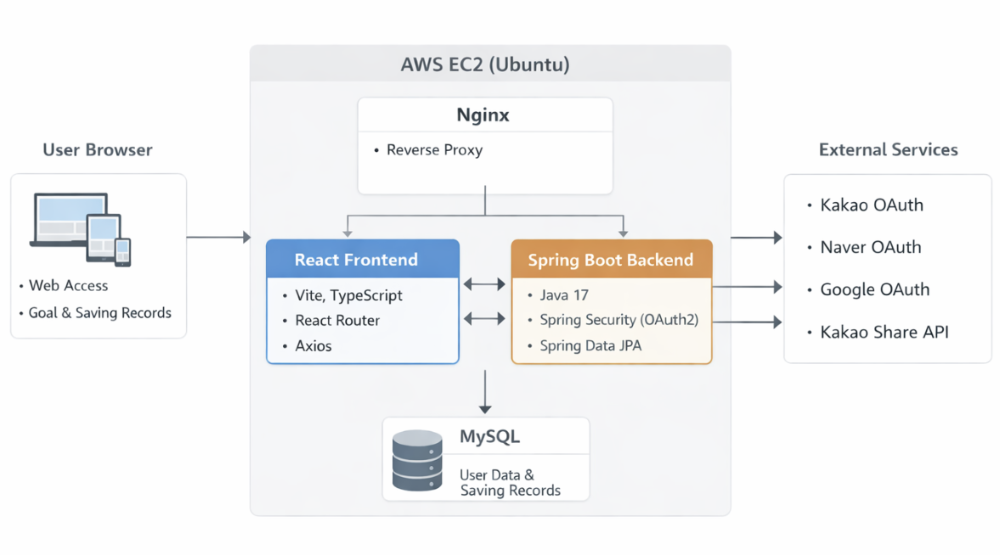
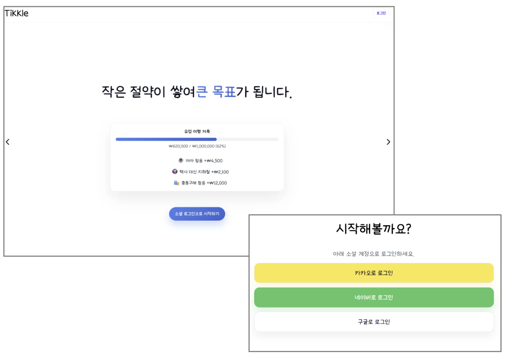
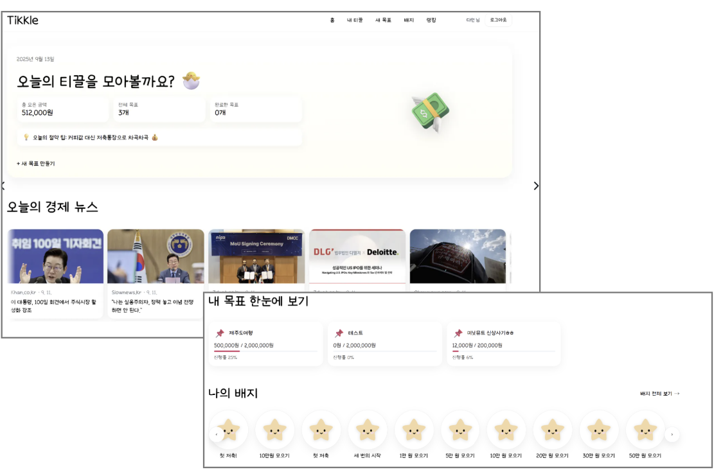
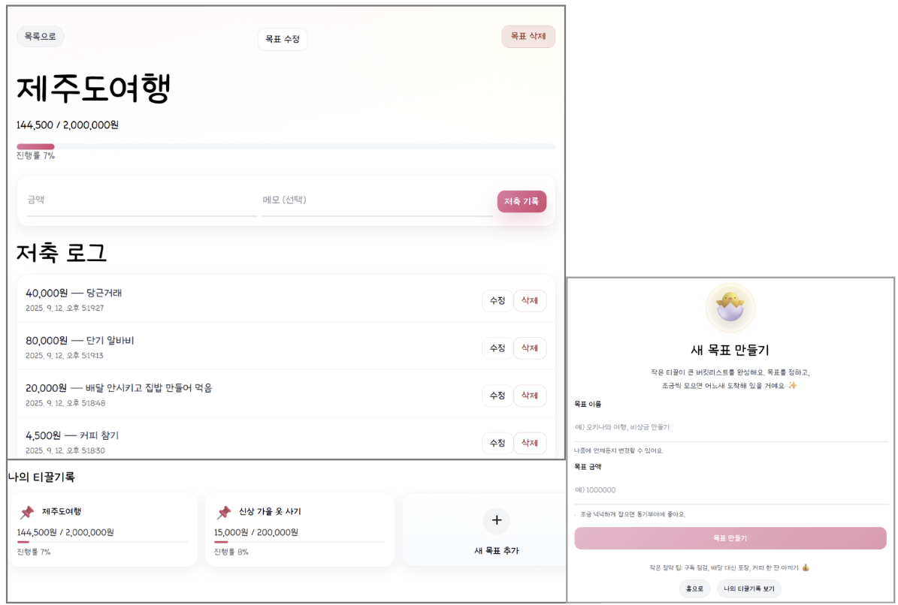
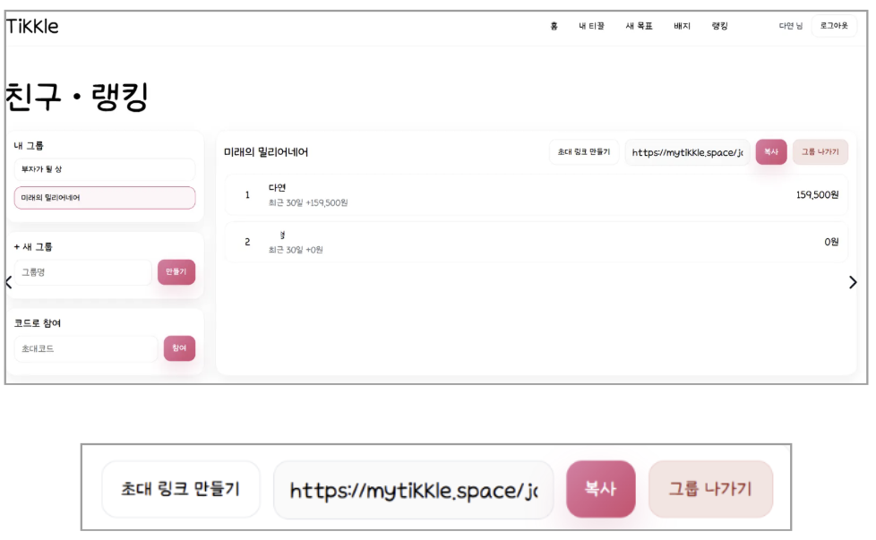
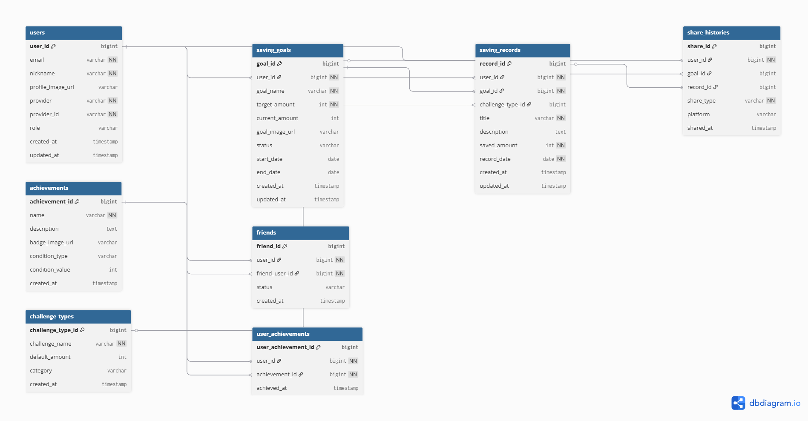

# 티끌

일상 속 작은 절약을 기록하고, 목표 달성과 친구 간 경쟁 요소를 통해 저축 습관 형성을 유도하는 챌린지형 저축 목표 관리 서비스입니다.

## 배포 및 저장소 링크
- 서비스 주소: https://mytikkle.space/
- Backend Repository: https://github.com/soonybutter/tikkle.git
- Frontend Repository: https://github.com/soonybutter/tikkle_FE.git

## 프로젝트 개요
- 개발 기간: 2025.07 ~ 2025.12
- 참여 인원: 1명
- 담당 역할: 기획, 프론트엔드, 백엔드, 배포 전반 직접 수행

## 기술 스택

### Frontend
- React (Vite)
- TypeScript
- Axios
- React Router

### Backend
- Java
- Spring Boot
- Spring Security (OAuth2)
- Spring Data JPA

### Database
- MySQL

### Infra
- AWS EC2 (Linux)
- Nginx (Reverse Proxy)

### Tools
- Spring Tool Suite (STS)
- Visual Studio Code
- Gradle
- Git
- GitHub

### External API
- 딥서치 Open API (경제 뉴스)
- Kakao Login API
- Naver Login API
- Google Login API
- KakaoTalk Share API

## 시스템 아키텍처


- React(Vite) 기반 프론트엔드와 Spring Boot 백엔드를 분리해 구성했습니다.
- Nginx Reverse Proxy를 통해 서비스 요청을 처리하도록 배포 환경을 구성했습니다.
- MySQL에 사용자, 목표, 저축 기록 데이터를 저장하고, 외부 OAuth 및 공유 API를 연동했습니다.

## 주요 기능
- 저축 목표 설정
- 저축 기록 추가 및 삭제
- 목표 진행률 반영
- 배지 획득 기능
- 친구 초대 및 그룹 랭킹 조회
- 경제 뉴스 조회
- 카카오톡 공유 기능
- 카카오 / 네이버 / 구글 소셜 로그인

## 페이지별 화면 설명

### 1) 랜딩 페이지


서비스 소개 및 간편 로그인 제공
- 기능:
  - 서비스 핵심 소개 제공
  - 카카오·네이버·구글 소셜 로그인 진입
  - 로그인 후 메인 서비스로 이동
    
- 구현 내용:
  - OAuth2 기반 간편 로그인 연동
    - 카카오·네이버·구글 소셜 로그인을 연동하여 별도 회원가입 절차 없이
      사용자가 간편하게 서비스에 진입할 수 있도록 인증 흐름을 구성했습니다.
  - 로그인 진입 흐름 최적화
    -랜딩 페이지에서 바로 로그인 기능으로 연결되도록 설계하여,
    서비스 탐색 후 별도 복잡한 절차 없이 
    핵심 기능으로 빠르게 이동할 수 있도록 구현했습니다. 

### 2) 메인 페이지


오늘의 절약 현황, 목표, 배지, 경제 뉴스 통합 제공

- 기능:
  - 총 모은 금액, 전체 목표 수, 완료한 목표 수 조회
  - 경제 뉴스 조회
  - 목표/배지/랭킹 페이지로 이동
    
- 구현 내용:
  - 목표 진행률 계산 및 시각화 구현
    - 각 목표의 진행률은 현재 누적 금액 / 목표 금액 × 100 방식으로 계산하고,
      계산된 값을 카드형 UI와 프로그레스 바로 시각화하여 
      목표별 달성 상태를 직관적으로 확인할 수 있도록 구성했습니다.
  - 딥서치 뉴스 API 연동
  - 배지 조회 및 슬라이드 UI 구성


### 3) 저축 로그 페이지


목표 생성 및 저축 로그 등록, 수정 및 삭제 관리

- 기능:
  - 목표 별 저축 로그 등록, 수정, 삭제
  - 저축 누적 금액 반영
  - 목표 진행률 조회
  - 저축 기록 목록 확인
    
- 구현 내용:
  - 목표 ID 기반 상세 기록 조회
  - 저축 로그 등록 처리
    - 특정 목표에 연결된 저축 기록으로 저장하고,
     해당 목표의 누적 금액과 기록 목록에 즉시 반영되도록 구성했습니다. 
  - 로그 수정·삭제에 따른 데이터 동기화 처리
    - 기존 저축 로그 수정 또는 삭제 시 변경된 금액을 기준으로 
     목표 누적 금액을 재계산하여,
     화면에 표시되는 진행률과 실제 저장 데이터가 일관되도록 구현했습니다. 


### 4) 친구 초대 · 랭킹 페이지


사용자가 그룹을 생성하거나 초대 코드를 통해 참여하고, 친구들과 랭킹을 비교할 수 있도록 구현한 페이지

- 기능:
  - 그룹 생성
  - 초대 링크 생성 및 복사
  - 초대 코드로 그룹 참여
  - 그룹 별 랭킹 조회
    
- 구현 내용:
  - 초대 링크/코드 기반 친구 초대 기능 구현
    - 그룹별 초대 코드 또는 링크를 생성하고 복사할 수 있도록 구성하여,
      사용자가 외부 메신저를 통해 친구를 손쉽게 초대할 수 있도록 했습니다.
  - DB 조회 기반 랭킹 산출
    - 구현 당시 DB 조회를 통해 사용자별 절약 금액을 집계하고 정렬하는 방식으로 처리했습니다.
    - 이후 학습을 통해 랭킹처럼 조회 빈도가 높고 정렬이 중요한 기능은 Redis나 캐시 기반 구조가 더 효율적이라는 점을 개선 포인트로 정리했습니다.
   


## ERD


- 목표, 저축 기록, 배지, 초대, 랭킹 관련 데이터를 기능별로 분리해 설계했습니다.
- 세부 테이블 구조는 ERD를 통해 확인할 수 있습니다.

## 핵심 구현 포인트

### 목표와 저축 로그 분리 설계
- 목표 데이터와 저축 로그 데이터를 분리 저장하여 기록 변경과 진행률 계산이 유연하게 이뤄지도록 구성했습니다.
- 단순 기록 저장이 아니라 누적 금액과 진행 상태를 함께 관리할 수 있도록 설계했습니다.

### 진행률 정합성 유지 로직
- 저축 로그가 추가, 수정, 삭제될 때마다 목표 누적 금액을 재계산했습니다.
- `누적 금액 / 목표 금액 × 100` 방식으로 진행률을 다시 반영해 사용자 화면과 실제 데이터가 일치하도록 했습니다.

### 다중 OAuth2 로그인
- 카카오, 네이버, 구글 소셜 로그인을 지원해 사용자 접근성을 높였습니다.
- OAuth2 인증 과정에서 state 검증을 적용해 위조 요청 가능성을 줄였습니다.

### URL 기반 친구 초대
- 초대 링크를 공유하는 방식으로 친구를 초대할 수 있도록 구현했습니다.
- 별도 복잡한 절차 없이 사용자 간 연결이 가능하도록 접근성을 높였습니다.

### 랭킹 기능의 확장성 고려
- 초기 랭킹은 DB 기반 집계·정렬 방식으로 구현해 기능을 완성했습니다.
- 이후 조회 빈도와 실시간성을 고려할 때 Redis Sorted Set 등 캐시 기반 구조가 더 적합하다는 개선 방향을 도출했습니다.

## 트러블슈팅

### 1) 저축 로그–목표 진행률 정합성 문제
#### 문제 상황
저축 로그 추가·수정·삭제 시 목표 누적 금액과 진행률이 실제 기록과 불일치할 가능성이 있었습니다.

#### 원인 분석
저축 로그는 개별 기록 단위로 저장되지만, 진행률은 목표 단위의 누적 금액을 기준으로 계산되기 때문에 로그의 추가뿐 아니라 수정·삭제 상황까지 모두 반영해야 했습니다.  
단순히 기록만 저장하는 구조로는 목표 진행 상태를 정확하게 유지하기 어려웠습니다.

#### 해결 방법
로그 변경이 발생할 때마다 목표의 누적 금액을 재계산하고,  
`누적 금액 / 목표 금액 × 100` 방식으로 진행률을 다시 반영하도록 구현했습니다.

#### 결과
저축 기록과 목표 진행률 간 데이터 정합성을 유지했고, 사용자가 보는 진행 현황의 신뢰도를 높일 수 있었습니다.

### 2) 그룹 랭킹을 DB 조회 기반으로 구현하며 성능 한계를 인식
#### 문제 상황
그룹별 랭킹 조회 시 사용자 절약 금액을 집계하고 정렬해야 해 조회가 많아질수록 DB 부하가 커질 수 있었습니다.

#### 원인 분석
프로젝트 당시에는 DB 기반 집계·정렬 방식으로 우선 구현해 기능을 완성했습니다.  
이후 실시간성과 조회 빈도를 고려하면 Redis Sorted Set 등 캐시 기반 구조가 더 적합하다는 점을 인지했습니다.

#### 해결 방법
초기에는 DB 기반 집계·정렬 방식으로 안정적으로 기능을 구현했고, 이후 확장 시 캐시 기반 구조로 개선할 방향을 정리했습니다.

#### 결과
초기 서비스에서는 랭킹 기능을 안정적으로 제공할 수 있었고, 이후 적용 가능한 성능 개선 방향까지 도출했습니다.

## 실행 방법

### Backend
```bash
git clone https://github.com/soonybutter/tikkle.git
cd tikkle

# 개발 실행
./gradlew bootRun --args="--spring.profiles.active=local"

# 배포용 빌드 및 실행
./gradlew bootJar
java -jar build/libs/*.jar --spring.profiles.active=prod
